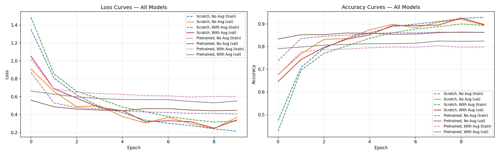
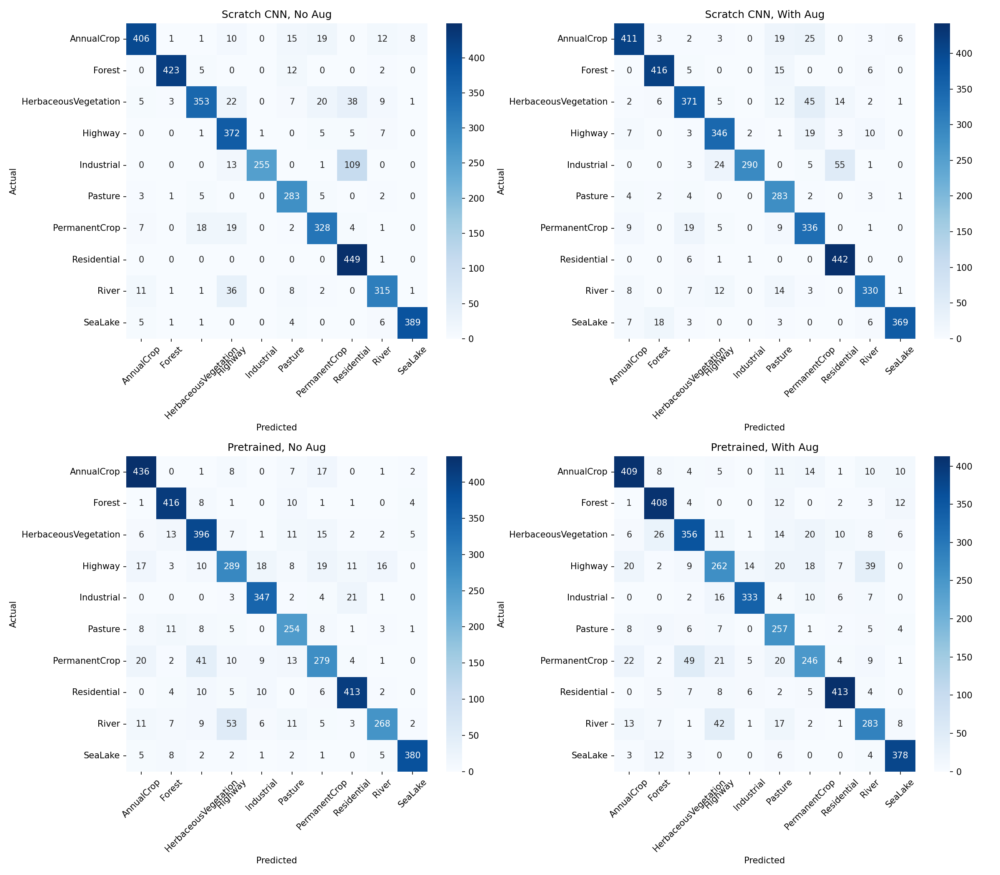

# Project Sentinel — Eyes of the Highway Reserve

Land-use/land-cover classification on Sentinel-2 satellite imagery (EuroSAT dataset), built as a vision pipeline prototype for automated satellite monitoring of a wildlife reserve–highway corridor.

## Notebook

Full training notebook (Google Colab): https://colab.research.google.com/drive/1bGCuiDThN-aziZbMEWunh-3nKe0Err6c?usp=sharing

## Dataset

- **Source:** [EuroSAT — Kaggle](https://www.kaggle.com/datasets/apollo2506/eurosat-dataset)
- **Version used:** RGB JPEG (`EuroSAT/` folder), 10 classes, ~27,000 images
- **Classes:** AnnualCrop, Forest, HerbaceousVegetation, Highway, Industrial, Pasture, PermanentCrop, Residential, River, SeaLake
- **Split:** 70% train / 15% validation / 15% test (fixed random seed for fair comparison across all runs)

## Models & Architecture

**1. Scratch CNN (TinyVGG-style)**
- 3 convolutional blocks (Conv → ReLU → Conv → ReLU → MaxPool), channels 32 → 64 → 128
- Classifier head: Flatten → Linear(256) → ReLU → Dropout(0.5) → Linear(10)
- Trained fully from scratch, no pretrained weights

**2. Transfer Learning — ResNet18**
- Pretrained on ImageNet
- All backbone layers frozen
- Final fully-connected layer replaced and fine-tuned for 10 EuroSAT classes

## Data Augmentation

Applied to the "with augmentation" runs: random horizontal flip, random vertical flip, random rotation (±15°), followed by normalization (ImageNet mean/std). The "no augmentation" runs use only resize + normalization.

## Results (Test Set)

| Model | Augmentation | Test Accuracy |
|---|---|---|
| Scratch CNN | No | 88.22% |
| Scratch CNN | Yes | **88.74%** |
| Pretrained ResNet18 | No | 85.88% |
| Pretrained ResNet18 | Yes | 82.59% |

**Key findings:**
- The scratch CNN slightly outperformed the frozen-backbone pretrained ResNet18 on this dataset — likely because ImageNet features (tuned for everyday photos) transfer imperfectly to top-down satellite imagery, and freezing the backbone limited adaptation within 10 epochs.
- Augmentation improved the scratch CNN's generalization (closer train/val accuracy, less overfitting) but slightly hurt the pretrained model, which had less capacity to adapt to added variation with only its final layer trainable.
- All models converged well within 10 epochs; loss and accuracy curves are included below.

## Loss & Accuracy Curves

## Confusion Matrices

Most confusion occurs between visually similar classes — e.g., Industrial↔Residential and River↔Highway — which is expected given their similar textures and colors in top-down satellite imagery.

## Tech Stack

PyTorch, Torchvision, scikit-learn, Matplotlib/Seaborn, Google Colab (T4 GPU)
